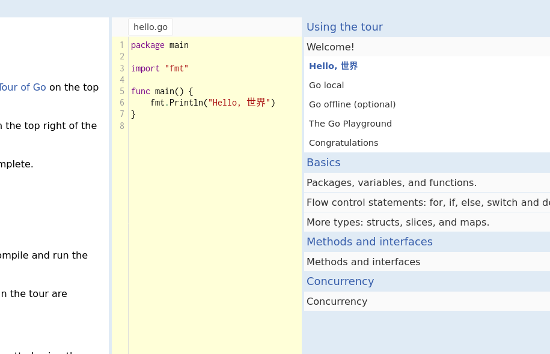

# tour of go

Пройдите первую часть (Basics) tour of go на [сайте](https://tour.golang.org/welcome/1).

После того как вы пройдёте все задачи, впишите название последней функции, которую нужно было имплементировать.

